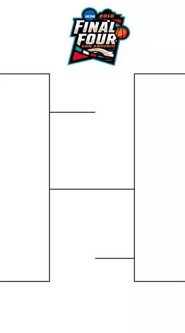

# Challenges
Use DOM manipulation to complete the following challenges. For each challenge, start by remixing [this starter project](https://glitch.com/edit/#!/remix/javascriptstarter).

[StackBlitz Mirror](https://stackblitz.com/edit/web-platform-oitfrwv3?file=index.html)

## 1. Which is Bigger?
Create an HTML page with two inputs and one button. When the button is clicked, the page should display which of the two inputs contains a larger value.

## 2. Guessing Game
Make a guessing game web page where the user is told to type in a number from 1 to 10. The user can enter a number in a text box and click a "Guess" button. The page should tell the user if they are too low, too high, or exactly right!

### Bonus Options
Try to add these additional features to the guessing game:

- Make the correct answer a random number (rather than hard-coded)
- Track how many guesses it took for the user to get to the right answer, and track the lowest number of guesses as the high score

## 3. Button-based Calculator
Create a button-based calculator that can perform addition, subtraction, division, and multiplication.

### Buttons
The HTML for the calculator should consist of many buttons:

- One button for each numeric digit (0-9)
- One button for open and close parenthesis: `(` and `)`
- One button for each basic math operator: `+`, `-`, `/`, and `*`
- One button to perform the final calculation: `=`

### Input
There should be one HTML `<input />` storing the running equation.

### Functionality
This is what everything should do.

#### Character Buttons
When any button other than the `=` button is clicked, the program should add that character to the running equation. Additionally, the program should display the current equation in the HTML input. For example, if the "2" button is pressed, the program should display "2". Then, if the "+" button is pressed, the program should display "2+". Then, if the "1" button is pressed, the program should display "2+1".

#### Equals Button
When the `=` button is pressed, the program should:
- Display the result of the equation in an alert
    - Ex, if the equation is "2+1", display "3"
- Clear the current equation

## 4. March Madness
Create an HTML page to represent a bracket (like March Madness). Start with a simplified Final Four bracket, with four inputs, each feeding into the tournament:

The user should be able to enter four teams for each Final Four spot. There should be a button to simulate a bracket situation by randomizing the winners of each game. The page should fill in the remaining bracket inputs with the randomized results.

### Extra Challenge - More Teams
If the Final Four functionality works, add in the previous round of the bracket surrounding the Final Four: the Elite Eight. There should be eight inputs where the user can enter team names, and the page should randomize results for each game.

### Extra Challenge - Seeding probability
The page should take into account the seeds of each team during the simulation. Add a small additional input field next to each team input. The page should use these seeds to make it more likely that a lower seed will randomly win the game.
