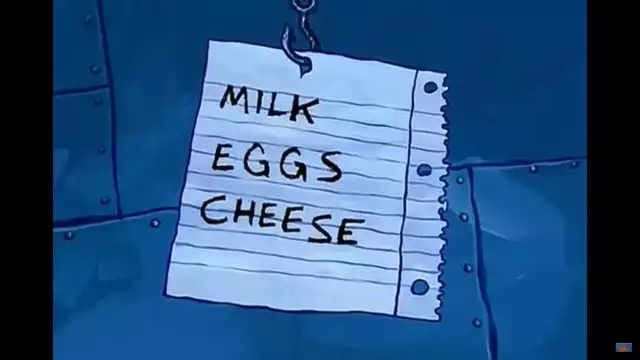
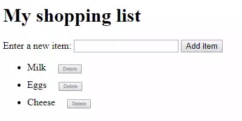

# Challenge: Shopping List
For this challenge, make a simple shopping list that allows the user to dynamically add items to the list using a form input and button. When adding an item to the input and pressing the button:

- The item should appear in the list
- The input should be emptied
- (BONUS) Each item should be given a button that can be pressed to delete that item off the list

The finished product should look like this:

Not really. Actually, it should look something like this:

To complete the exercise, follow the steps below, and make sure that the list behaves as described above.

## HTML
Start by forking [this starter Repl](https://replit.com/@HylandOutreach/JavaScriptStarter). Then, in the **index.html** file, add the following:

- A header saying "My shopping list"
- Some text saying "Enter a new item:"
- An input with a unique `id` attribute
- A button saying "Add item"
- An unordered list with a unique `id` attribute

## JavaScript
In the **script.js** file, define a function that will run in response to the button being clicked. Make sure to hook up the function to the button in the HTML! Then, inside the function body:

- Create two variables that hold references to the list (`<ul>`), and `<input>` elements
- Store the current value of the input element in a variable
- Next, empty the input element by setting its value to an empty string - `""`
- Then, create three new elements - a list item (`<li>`), ``, and `<button>`, and store them in variables
- Append the span and the button as children of the list item  
- Set the text content of the span to the input element value saved earlier, and the text content of the button to `"Delete"`
- Append the list item as a child of the list
- (BONUS) Attach an event handler to the delete button, so that when clicked it will delete the entire list item it is inside

After following all of these steps (including the BONUS), it should be possible to add and remove items from the shopping list! Feel free to add styles to the list to make it look a little nicer.
