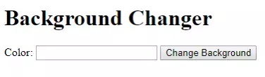

# Self-Paced Work: Background Changer Revisited
Previously, there was a webpage that could change its background color on a button click. The page would ask for colors using `prompt`s, and then set the background color. Improve that webpage by using an HTML input instead of `prompt`s to get a color from the user!

## Part 1 - HTML Setup
Start by remixing [this starter project](https://glitch.com/edit/#!/remix/javascriptstarter), then follow the steps below.

1. Open the **index.html** file for editing
1. In the `<body></body>`, add an `<h1>` header saying `Background Changer`
1. Under the header, add a new `<p>` paragraph
1. Within the paragraph, add text that says "Color: "
1. Within the paragraph, add an `<input />` with a `type` of `"text"`
    - Give the `<input />` an `id` attribute with value `"color-input"`
1. Within the paragraph, add a `<button>` with text `Change Background`
1. Underneath the paragraph, add a `<div>` element
    - Give the `<div>` an `id` attribute with value `"color-list"`
    - _Note: at this point, the `<div>` should not appear on the page_

At the end of this section, the page should look something like this:



## Part 2 - JavaScript Setup
Now that the HTML is in place, it's time to add some JavaScript.

1. Open the **script.js** file for editing
1. In the file, _define_ a new function named `changeBackground`
    - `function` keyword
    - Function name (`changeBackground`)
    - Parentheses (`()`)
    - Curly brackets (`{}`)
1. Open up the **index.html** file for editing
1. Set the `onclick` attribute of the `<button>` element to _call_ the `changeBackground` function

At this point, the code in the `changeBackground` function should run every time the button on the page is clicked!

## Part 3 - Changing the Background Color
Now that the button is hooked up, it should actually change the background color based on what is in the text box!

### Getting the Color from the Input
The first step is to pull the color from the text box `<input />` element.

1. Open the **script.js** file for editing
1. In the body of the `changeBackground` function, create a new variable named `colorInput`
1. Set the value of `colorInput` using `document.querySelector` to select the HTML `<input />`
    - `document.querySelector("")`
    - `id` selector within the quotes (`#color-input`)
1. Under the `colorInput` variable, create a new variable named `colorValue`
1. Set the value of `colorValue` using `.value` to get the actual text value from the `colorInput` element

Now, the value entered into the text box should be stored in the `colorValue` variable.

### Setting the Background Color to the New Color
Next, it's time to use that color value to set the background of the page. Use this line of code, in the body of the `changeBackground` function:

```js
document.body.style.background = colorValue;
```

Test out the button with a few different colors in the input, and verify that the background color changes!

## Part 4 - Listing Previous Colors
Whenever the background color changes, the web page should keep track of the new color and display a running list to the user.

### Getting the Container `<div>`
There is a `<div>` element meant to contain the list of previous colors. Start by storing that element in a variable.

1. At the bottom of the `changeBackground` function, create a new variable named `colorListDiv`
1. Set the value of `colorListDiv` using `document.querySelector` to select the HTML `<div>`
    - `document.querySelector("")`
    - `id` selector within the quotes (the `id` is `color-list`)

Now, the container should be available in the body of the `changeBackground` function.

### Creating a New `<p>` Element
Now that the `<div>` has been stored, it will be necessary to create something to add to it!

1. Underneath the `colorListDiv` variable, create a new variable named `newColorPara`
1. Set the value of `newColorPara`: use `document.createElement` to create a new `p` paragraph
    - `document.createElement("")`
    - Tag name within the quotes (`p`)
1. Under the variable creation, use `.textContent` to set the text value of `newColorPara`
    - Variable name
    - `.textContent`
    - Set the value to the color the user entered (stored in the `colorValue` variable)

Now, the new paragraph element has been created and fully formed!

### Appending the New `<p>` Element to the Container `<div>`
So the new `<p>` element exists, but it should not appear yet... it must be appended to another element!

At the bottom of the `changeBackground` function, use `.appendChild` to add `newColorPara` as a child of `colorListDiv`:

- Parent element variable (container)
- `.appendChild()`
- Child element variable (new paragraph) within the parentheses

After these changes, try running the program. Enter some colors, click the button a few times, and verify that the background changes _and_ the list populates with each new color!

## Challenges
After this activity, there are some challenges to attempt:

- [Shopping List Challenge](Challenges/ShoppingListChallenge.md)
- [Table Data Challenge](Challenges/TableDataChallenge.md)
