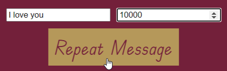

# Challenges: All `for` One and One `for` All
Try to complete these `for` loop challenges!

Start by remixing [this project](https://hytop.onrender.com/c/allforone).

Run the program and test out some of the buttons. Some of them are working, some of them are a little broken, and some of them do not do anything! Follow these instructions to update the functionality of each button.

Note that the **Existing Buttons** challenges are simpler than the **New Buttons** challenges. Feel free to hop around to whatever you would like!

## Existing Buttons
Note that all changes for these challenges should take place in the **script.js** file - none of the HTML or CSS will need to be updated.

### Repeat Hello
Currently, the `repeatHello` function has an `alert` statement that runs `5` times. Update this so that instead, it runs `6` times!

Click the "Repeat Hello" button and make sure that six total messages appear.

### Repeat Goodbye
Currently, the `repeatGoodbye` function does not actually do anything. Update this so that instead, displays a message of `"Goodbye"` - it should do this `5` times.

Click the "Repeat Goodbye" button and make sure that the five messages appear.

### Add Mottos
Currently, the `addMottos` function does not actually do anything. Update this so that instead, it runs through the loop a total of `10` times. Each statement in the `for` loop declaration should be updated:

- _Initialization_
- _Condition_
- _Increment_

Once done, click the "Add Mottos" button and make sure that new paragraph elements are appended to the page. Note that the "Clear Mottos" button should be able to clear out all the elements as needed.

### Daft Punk
Currently, the `daftPunk` function repeats a message. This functionality should stay the same, but the code should use a `for` loop instead! Update it so that it uses a loop to repeat the `alert` statement. There should only be _one_ `alert` in the function body.

Once done, click the "Daft Punk" button and verify that it still works the same!

### Good Will Hunting
Currently, the `goodWillHunting` function does nothing. Add code so that it repeats "It's not your fault" a total of 12 times.

Click the "Good Will Hunting" button and verify that it repeats the message the appropriate number of times!

### Count
Currently, the `count` function doesn't actually do anything. It gets the value from an HTML `<input />`, but that's about it. Update the body of the function so that it counts like Count von Count. It should count up to the number provided in the `<input />` (stored in `countMax`). It should start at `1`. For example, if the user entered "5" in the box, this should be the output:

```
1! Ah, ah, ah.
2! Ah, ah, ah.
3! Ah, ah, ah.
4! Ah, ah, ah.
5! Ah, ah, ah.
```

Enter a number in the "Count to..." text box, click the "Count" button, and make sure it counts correctly!

### Count Evens
Currently, the `countEvens` function doesn't do anything. Update the body of the function so that it counts like Count von Count, but it only counts the even numbers. It should count up to the number provided in the `<input />` with an `id` of `count-evens-to`. It should start at `0`. For example, if the user entered "6" in the box, this should be the output:

```
0! Ah, ah, ah.
2! Ah, ah, ah.
4! Ah, ah, ah.
6! Ah, ah, ah.
```

Enter a number in the "Count evens to..." text box, click the "Count Evens" button, and make sure it counts correctly!

### Repeat Message
Currently, the `repeatMessage` function does not even exist. Define it, and make it do something! It should take the _message_ stored in `<input id="rep" />`, and the _number_ stored in `<input id="times" />` and repeat the _message_ that _number_ of times.

For example, if the user enters "I love you" as the message, and "10000" as the times, it should repeat "I love you" 10000 times when the "Repeat Message" button is clicked.



For an added challenge, make the messages appear directly on the page instead of using `alert` statements.

## New Buttons
For these challenges, create new `<button>` elements in the HTML, and hook them up to JavaScript functions.

### Add Images
Get an image URL from the user using an `<input />`. Also, get a number from the user using another `<input />`. Create a button that, when clicked, will:

- Loop through the appropriate number of times
- For each loop:
    - Create a `` element
    - Set the proper `src` attribute
    - Add the element to the page

### Leap Years
Leap years are defined as follows:

- If the year is divisible by `4` then it is a leap year
- Except if the year is divisible by `100` then it IS NOT a lear year
- Except if the year is divisible by `400` then it is a leap year

Create a function that does the following:

- Get the current year
- Generate the next 50 leap years based on the current year
- Add each future leap year to the page in a bordered container

### Squares
Create a button that, when clicked, displays the square of the first 25 odd positive integers.

### Sum
Create a button that computes the sum of first `n` positive integers:

```
sum = 1 + 2 + 3 + ... + n
```

#### Examples
Here are some examples:

- `n = 5`: `sum = 15`
- `n = 19`: `sum = 190`

Allow the user to input the value of `n` using an HTML `<input />` element.

### Diamond
Create a button that, when clicked, adds a diamond of stars to the page. The height of the diamond should be supplied by the user in an `<input />`. It is defined by the distance between the top line of stars and the middle line of stars.

#### Examples
Here are some examples.

User inputs `1`, add this to the page:
```
 *
* *
 *
```

User inputs `3`, add this to the page:
```
   *
  * *
 *   *
*     *
 *   *
  * *
   *
```

### Repeat Pattern
Create a function that will repeatedly add a pattern to the page at a regular interval, then scroll down to each new line of the pattern. It should end up looking something like this:


This will require a bit of research. Here are a few resources:

- [Scrolling to the bottom of the page in JavaScript](https://stackoverflow.com/questions/11715646/scroll-automatically-to-the-bottom-of-the-page)
- [Asynchronous functions & sleep](https://stackoverflow.com/questions/951021/what-is-the-javascript-version-of-sleep)
    - The example on this page should be helpful
- [Remainder operator](https://developer.mozilla.org/en-US/docs/Web/JavaScript/Reference/Operators/Remainder)

Good luck!
