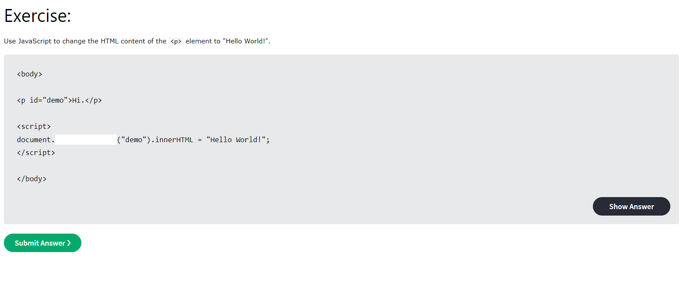

# Challenges
Attempt either of the challenges below, or both!

## W3 Schools HTML Challenges
[Click here for HTML Exercises on W3 Schools.](https://www.w3schools.com/html/exercise.asp)

## 3D Transforms CSS Challenges
[Click here for some interesting 3D transform CSS challenges.](https://3dtransforms.desandro.com/)

        

          
front

          
right

          
back

          
left

          
top

          
bottom

        

      
