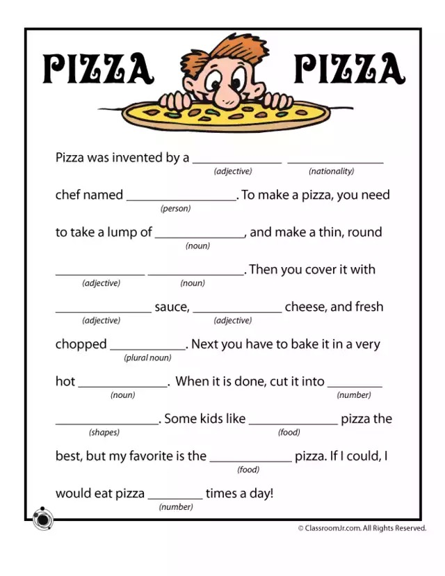

# Mad Libs Follow-Along
Create a webpage that will allow the user to enter some individual words and tell a silly story.



## Basic Setup
Start by forking [this empty Repl](https://replit.com/@HylandOutreach/EmptyWeb), then follow the steps below.

1. Open the **index.html** file
1. Add the basic tags: `html`, `head`, `body`
1. Create a new JavaScript file called `MadLibs.js`
1. Link the JavaScript file in the HTML file using a `script` tag

## Creating the Inputs in HTML
1. In the HTML file, create an appropriate header for the webpage saying "Pizza Pizza"
1. Create a `p` paragraph element containing a text label and a textbox input for "Adjective"
    - Ensure that the `input` element has an `id` attribute
1. Create additional `p` elements containing labels and inputs for "Nationality" and "Person"

##### index.html
```html
<html>
    <head>
        <script src="MadLibs.js"></script>
    </head>
    <body>
        <h1>Pizza Pizza</h1>
        <p>Adjective: <input id="adj1"></p>
        <p>Nationality: <input id="nationality"></p>
        <p>Person: <input id="person"></p>
    </body>
</html>
```

## Defining the Function in JavaScript
In the JavaScript file, define a new function named `madLibs`:
- `function` keyword
- function name (`madLibs`)
- parentheses (`()`)
- curly brackets (`{}`)

##### MadLibs.js
```js
function madLibs() {

}
```

## Getting the Values from Inputs
In the body of the `madLibs` function:

1. Store the"Adjective" input element in a variable
    - new variable (`var adj1El = `)
    - `document.querySelector()`
    - quotes (`""`)
    - selector for the first input (`#adj`)
1. Store the text from the input element in a variable
    - new variable (`var adj1Val = `)
    - element variable (`adj1El`)
    - `.value`
1. Repeat the above steps for each of the three inputs

##### MadLibs.js
```js
var adj1El = document.querySelector("#adj1");
var adj1Val = adj1El.value;

var nationalityEl = document.querySelector("#nationality");
var nationalityVal = nationalityEl.value;

var personEl = document.querySelector("#person");
var personVal = personEl.value;
```

## Displaying the Story
Create an alert and put the story together. It should use the variables in place of the blanks for the first sentence of the Mad Libs.

##### MadLibs.js
```js
alert("Pizza was invented by a " + adj1Val + " " + nationalityVal + " chef named " + personVal + ".");
```

## Hooking Up a Button
Finally, create a button in the HTML that will call the `madLibs` function when clicked! Place it inside of a `p` so it appears on its own line.

##### index.html
```html
<p><button onclick="madLibs()">Generate Mad Libs!</button></p>
```

## Final Code
##### index.html
```html
<html>
    <head>
        <script src="MadLibs.js"></script>
    </head>
    <body>
        <h1>Pizza Pizza</h1>
        <p>Adjective: <input id="adj1"></p>
        <p>Nationality: <input id="nationality"></p>
        <p>Person: <input id="person"></p>
        <p><button onclick="madLibs()">Generate Mad Libs!</button></p>
    </body>
</html>
```

##### MadLibs.js
```js
function madLibs() {
    var adj1El = document.querySelector("#adj1");
    var adj1Val = adj1El.value;
    
    var nationalityEl = document.querySelector("#nationality");
    var nationalityVal = nationalityEl.value;

    var personEl = document.querySelector("#person");
    var personVal = personEl.value;

    alert("Pizza was invented by a " + adj1Val + " " + nationalityVal + " chef named " + personVal + ".");
}
```
